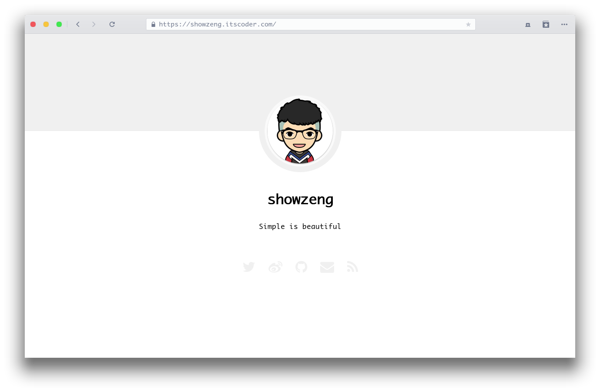

# Minimalism



Minimalism 是一款基于 Jekyll 为极简主义者打造的极简主题。你可以访问 [我的博客][blog] 或者 [主题 demo][demo] 来预览一下。

## 特性

**V0.1.0**
- 这款主题采用响应式布局，对各大主流浏览器做了兼容，对移动客户端做了适配
- 支持 RSS 订阅
- SEO 优化
- 文章默认采用 [CC BY-NC-ND 4.0][license] 协议对著作权进行保护，支持 emoji 表情
- 支持禁止复制、禁止右键菜单、复制附带版权声明等多种功能
- 支持文章打赏 (微信、支付宝)
- 支持评论功能 (目前支持来必力、gitment)
- 支持站点统计 (目前支持谷歌统计、百度统计、友盟 cnzz 统计)
- 最后且最重要的当然还是对博客文章极度的阅读体验优化

## 安装

在你的 `Gemfile` 文件中加入下面这一行:

```ruby
gem "jekyll-theme-minimalism"
```

在你的配置文件 `_config.yml` 中修改启用主题:

```yaml
theme: jekyll-theme-minimalism
```

然后使用 bundle 执行安装:

    $ bundle install

或者你也可以手动下载安装:

    $ gem install jekyll-theme-minimalism

## 配置

复制并粘贴下面的配置文件模板到你的 `_config.yml` 配置文件中，并填写好相关的配置项。

```yaml
# _config.yml

excerpt_separator: <!--more-->

defaults:
  -
    scope:
      path: ""
      type: "posts"
    values:
      layout: "post"
  -
    scope:
      path: "assets/img"
    values:
      image: true

# --- 网站信息设置 ---
# 下面填写你的博客标题
title:
# 下面填写你的网络常用名
name:
# 下面填写你的座右铭或者是个性签名
description:
# 你博客的 url 地址，比如：https://showzeng.github.io 或者是自定义的域名
url:
# 在页尾的版权时间信息，比如：2016-2018，默认是 2018 年
# copyright_time:
# 标签页的 logo 及博客的头像，如果你想引用网络图片资源，就取消下面的注解，并填写图片资源的 url 地址
# 或者，推荐的做法是将这两个图片资源下载到本地的 /assets/img/ 文件夹下，且图片名必须命名为 favicon 和 avatar
# favicon:
# avatar:
# --- 网站信息设置 ---


# --- 文章列表页 ---
# 文章列表是否显示摘要
# show_excerpt: true
# --- 文章页 ---


# --- 社交链接 ---
# 取消下面的注解，并填写相应的你要开启的社交链接
# twitter:
# weibo:
# github:
# 邮件地址前面带上 mailto:
# email:
# RSS 订阅
rss: true
# --- 社交链接 ---


# --- 站点统计 ---
# 如果你想开启站点统计，取消下面一行注解，并填写相应统计运营商给的 id，可支持多个同时开启
# site_statistics: true
# cnzz (友盟统计)
# cnzz_id:
# Baidu (百度统计)
# baidu_id:
# Google Analytics (谷歌统计)
# google_id:
# --- 站点统计 ---


# --- 版权声明 ---
# 禁止复制 (注：启用后仅文章页和关于页禁止复制)
# lock_copy: true
# 禁止右键菜单 (注：为全局设置，启用后所有页面均无法使用右键菜单)
# lock_menu: true
# 复制文本末尾添加版权声明 (注：启用后仅文章页和关于页复制添加版权声明)
# copy_with_declaration: true
# --- 版权声明 ---


# --- 打赏设置 ---
# 开启打赏，取消下面一行注解，并将微信和支付宝的收款二维码放置在 /assets/img/ 文件夹下
# 同时图片的文件名必须为 alipay 和 wechat
# reward: true
# 打赏的推广语
# reward_description: 如果你觉得本文对你有帮助，不妨请我喝杯咖啡
# --- 打赏设置 ---


# --- 评论设置 ---
# 开启评论，取消下面一行注解，并填写相应评论运营商提供的 id，目前仅支持来必力和 gitment
# comment: true
# 来必力 uid
# livere_uid:
# gitment 用户主，即 GitHub 用户名
# gitment_owner:
# GitHub pages 仓库名，如：showzeng.github.io
# gitment_repo:
# gitment 提供的对应 id 和 secret
# gitment_client_id:
# gitment_secret:
# --- 评论设置 ---
```

文章的单独头信息设置。

```markdown
<!-- 2018-08-08-example.md -->

---
title: "示例文章"
date: 2018-08-08 08:08:08 +0800
category: Demo
tags: [Minimalism, Demo]
comment: false
reward: false
excerpt: 这是这篇文章的摘要，或者你也可以在文章正文中使用 <!--more--> 标签来截断摘要。
---
```

除了 layout、title、date、category 等常规项外，你还可以使用：

- tags (文章相关的标签)
- comment (关闭文章评论)
- reward (关闭文章打赏)
- excerpt (文章摘要)

还是对配置有疑问？或者想要了解更详细的信息？查看 [demo] 或者 [wiki]。

## 支持

如果你觉得这个主题还不错，欢迎 star 或使用。你也可以自由的 fork，基于本主题打造你自己的主题，当然，希望最好是能署名或提及本博客主题。

此外你有什么好的建议、需求或者是碰到什么问题，欢迎提交 issue，本主题还会不断完善。

## 打赏

如果主题对你有帮助，并帮你节省了一些折腾的时间，可以考虑打赏，这是对我所做工作的最大肯定。


## Change log

**V0.1.1 (2018/08/12 20:24)**
- 修复缺少插件依赖配置

## License

The theme is available as open source under the terms of the [MIT License](https://opensource.org/licenses/MIT).

[blog]: https://showzeng.itscoder.com
[demo]: https://showzeng.github.io
[license]: https://creativecommons.org/licenses/by-nc-nd/4.0/
[wiki]: https://github.com/showzeng/Minimalism/wiki
